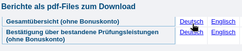
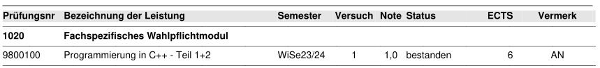
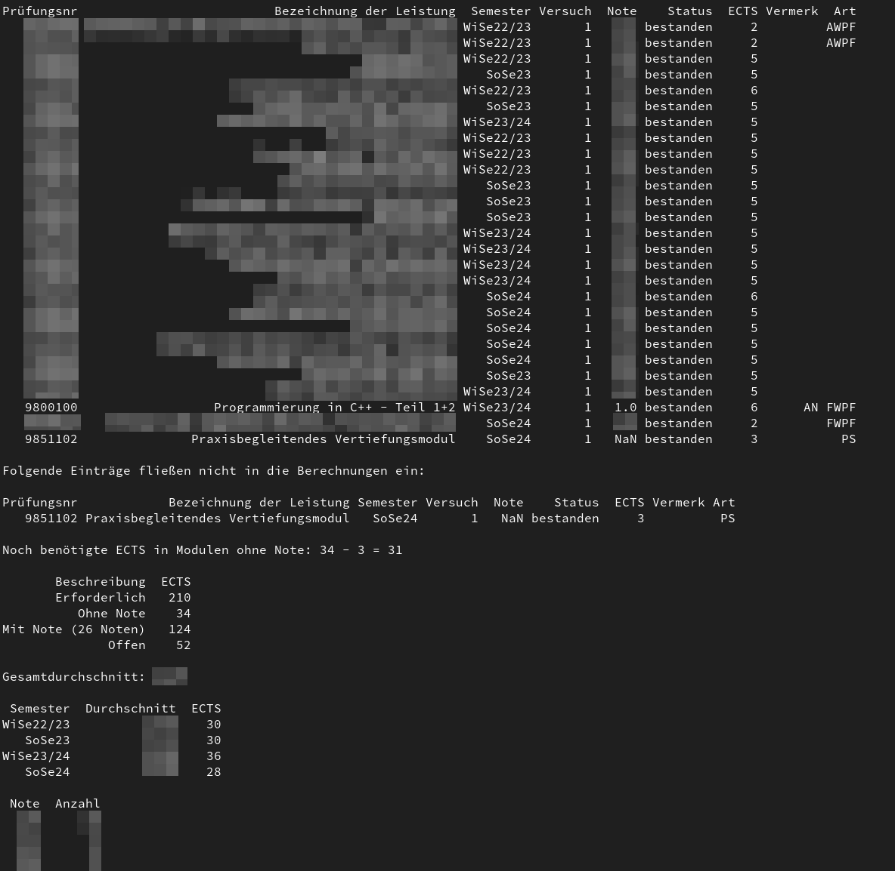
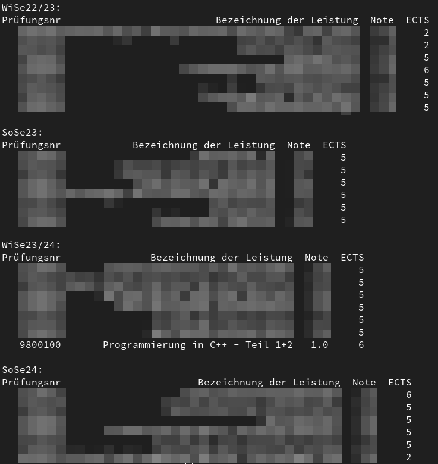

# studi-grades-py: Get information about your grades

<p align="center">
  <a href="https://github.com/fuchs-fabian/studi-grades-py/blob/main/LICENSE">
    
  </a>
</p>

## Description

You don't feel like typing out your grades every time and analysing them in EXCEL? Then you've come to the right place.

Simple Python3 script, which provides information about the grade overview in the study programme.

> Currently only the following PDF export is reliably supported:
>
> `Berichte als pdf-Files zum Download` -> `Gesamtübersicht (ohne Bonuskonto)` -> `Deutsch`
>
> 

The use of a PDF file or the processing of a CSV is supported. They only need to be structured as follows and must be in the folder of the Python script.

> If you have any bugs, suggestions or feedback, feel free to create an issue describing what you'd like to see or create a Pull Request.

### German Example (PDF)

> Must contain `abschluss` in the file name!

The structure of the table in the PDF file must be as follows:



Please note that it will probably only work if it is a product of "HIS eG". You will find a note in the footer of the website:


### German Example (CSV)

> Must be: `grades.csv`

The structure must be as follows:

```csv
Prüfungsnr,Bezeichnung der Leistung,Semester,Versuch,Note,Status,ECTS,Vermerk,Art
9800100,Programmierung in C++ - Teil 1+2,WiSe23/24,1,1.0,bestanden,6,AN,FWPF
```

## ⚠️ **Disclaimer - Important!**

It works very reliably under Linux. I can't say for Windows. Python3 must be installed?

## Getting Started

Clone the repository or download the corresponding release.

Install packages:

```bash
pip install pandas
pip install pdfplumber
```

## Usage

```bash
python3 studi-grades.py -h
```

```bash
usage: studi-grades.py [-h] [--lang {de,en}] [--csv] [--pdf]

Process studi-grades from CSV or PDF files. The script must be executed in the folder in which the CSV or PDF is located!

options:
  -h, --help      show this help message and exit
  --lang {de,en}  Select language: 'de' for German, 'en' for English
  --csv           Use CSV file
  --pdf           Use PDF file
```

If you execute the following, `de` is used as the default language and a PDF is read from the current directory.

```bash
python3 studi-grades.py
```

## Output

> A suitable CSV file is automatically created that you can reuse.

When a PDF file is read in, you get an overview of all this at the very beginning. This is not the case when using a CSV file.





## Needed support

There are a few `TODO`s in the code that would certainly be good to implement.

It would also be really cool to maybe create graphs or something?

## This might also interest you

[All-in-one (Typst) template for students and theses](https://github.com/fuchs-fabian/typst-template-aio-studi-and-thesis)
